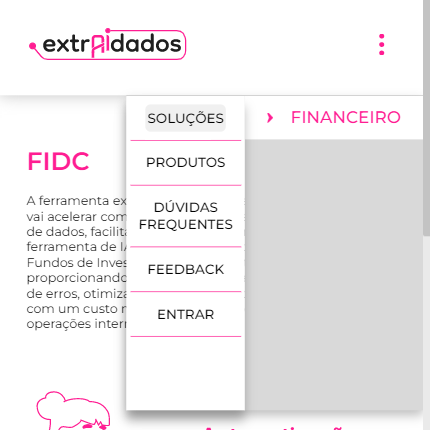

# ExtrAI dados

Essa aplicação web tem como intuito a apresentação da solução criada pela empresa Di2win, o Extraidados. 

## Índice

- [Visão Geral](#visão-geral)
- [Requisitos](#requisitos)
- [Instalação](#instalação)

## Visão Geral

O site não apresentava informações claras sobre o produto extrAIdados, o que tem dificultado a comunicação da empresa com potenciais clientes do setor financeiro, seu público-alvo. Essa versão criada pela equipe da Residência tecnológica veio com o intuito de melhorar essa apresentação do produto.

A aplicação conta com responsividade entre as diferentes tipo de tela, possui uma navegação fluida entre as páginas, através de um menu disposto ao topo da tela:

desktop:
 

mobile: 
 

## Requisitos

Para executar essa aplicação, é necessária alguns requisitos:

- Possuir o Angular instalado
- Possuir o NodeJS instalado
- Possuir algum editor de código
	- ex: VScode

## Instalação

Para instalar essa aplicação em sua maquina siga os passos abaixo:

1. Clone este repositório em sua máquina local.
2. Execute o comando `npm install` para instalar as dependências.
3. Execute o comando `ng server` para iniciar o servidor.
